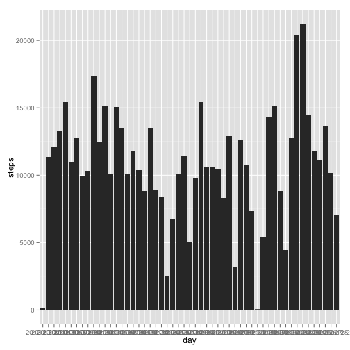
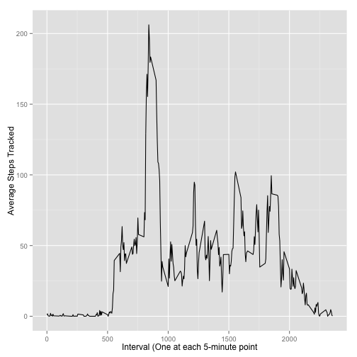
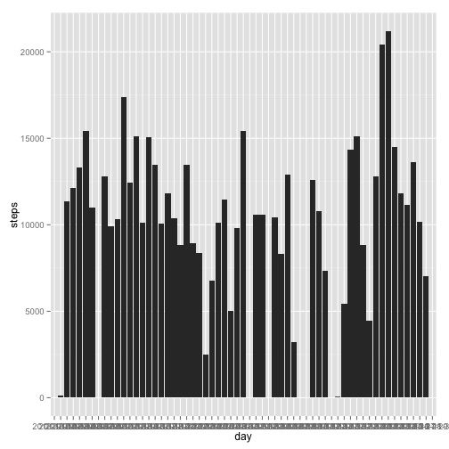
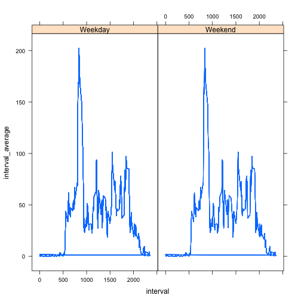

# Reproducible Research: Peer Assessment 1

## Introduction

This assessment analyzes data generated from wearable activity monitors. The data consists of two months of data from an anonymous individual collected during the months of October and November, 2012, and inclue the number of steps taken in 5-minute intervals each day. 

## Data

The variables in the dataset are:
        * steps: Number of steps taken during a 5-minute interval (missing values are coded as NA)
        * date: The date on which the measurement was taken in YYYY-MM-DD format
        * interval: Identifier for the 5-minute interval in which measurement was taken. 
        
The dataset is stored in a comma-separated-value (CSV) file and there are a total of 17,568 observations in this dataset.


## Loading and preprocessing the data

From within our Github repository, the dataset is stored as "activity.csv". We need to extract it 
by reading it into a dataframe with the read.csv() method:


```r
activity = read.csv("./activity.csv", header = T)
str(activity)
```

```
## 'data.frame':	17568 obs. of  3 variables:
##  $ steps   : int  NA NA NA NA NA NA NA NA NA NA ...
##  $ date    : Factor w/ 61 levels "2012-10-01","2012-10-02",..: 1 1 1 1 1 1 1 1 1 1 ...
##  $ interval: int  0 5 10 15 20 25 30 35 40 45 ...
```


Right away, it's noticeable that NA's are present along the entirty of certain days. As this suggests untracked activity, it's best to delete those days from our set


```r
activity = activity[!is.na(activity[1:nrow(activity), 1]), ]
```


Let's double check to make sure we've removed all NA's from the first column

```r
sum(is.na(activity[1:nrow(activity), 1]))  #Should be 0
```

```
## [1] 0
```


## What is mean total number of steps taken per day?

Now that we have full values for each day, we can make a histogram and calculate the mean and median steps per day.

First, though, we need a frame that stores daily step values for each day.


```r

daily_steps = data.frame(day = factor(), steps = factor())

for (i in 1:length(unique(activity[, 2]))) {
    
    step_count = 0
    current_day = unique(activity[, 2])[i]
    group = which(activity[, 2] == current_day)
    for (g in group) {
        step_count = step_count + activity[g, 1]
    }
    
    daily_steps = rbind(daily_steps, data.frame(day = current_day, steps = step_count))
}
```


Next, we construct the histogram by plotting the values in our day column against their 
counts in the step column


```r
library(ggplot2)

g = ggplot(daily_steps, aes(x = day, y = steps)) + geom_histogram()
print(g)
```

```
## Mapping a variable to y and also using stat="bin".
##   With stat="bin", it will attempt to set the y value to the count of cases in each group.
##   This can result in unexpected behavior and will not be allowed in a future version of ggplot2.
##   If you want y to represent counts of cases, use stat="bin" and don't map a variable to y.
##   If you want y to represent values in the data, use stat="identity".
##   See ?geom_bar for examples. (Deprecated; last used in version 0.9.2)
```

 


Furthermore, now that our daily counts our binned up in a specialized data frame, calculating the mean and median number of steps taken per day is fairly trivial. We'll just perform the opertions directly on the "steps" column in daily_steps 


```r

avg_daily_steps = mean(daily_steps$steps)
avg_daily_steps
```

```
## [1] 10766
```

```r

median_daily_steps = median(daily_steps$steps)
median_daily_steps
```

```
## [1] 10765
```


## What is the average daily activity pattern?

Here, we're looking to compute the daily averages FOR EACH TIME INTERVAL. For example, the average of the 10th-15th minute interval is the average number of steps reported for it across all days. 

We'll store those values in a dataframe, and then make a time-series line graph by laying the intervals out along the x-axis and the average step value along the y-axis. 


```r
interval_averages = data.frame(interval = numeric(288), steps = numeric(288))

for (i in 1:length(unique(activity[, 2]))) {
    # iterate over each unique date
    
    # get all intervals corresponding to this date
    intervals = activity[which(activity[, 2] == activity[i, 2]), ][3]
    
    # get all steps corresponding to this date
    steps = list(activity[((i - 1) * 288):(((i - 1) * 288) + 287), 1])
    
    # cumulatively build the steps count for each interval so we have a total to
    # average at the end
    interval_averages = data.frame(interval = intervals, steps = interval_averages$steps + 
        steps[[1]])
}
```

```
## Warning: longer object length is not a multiple of shorter object length
```

```r

# We have a frame that contains total steps for each interval -- now we just
# need to convert those totals to averages.

interval_averages[, 2] = interval_averages[, 2]/length(unique(activity[, 2]))
names(interval_averages)[2] = "average_steps"

# Now plot!
interval_plot = ggplot(interval_averages, aes(x = interval, y = average_steps)) + 
    geom_line() + xlab("Interval (One at each 5-minute point") + ylab("Average Steps Tracked")

print(interval_plot)
```

 


## Imputing missing values

I deleted the NA's from the data at the outset to better compute the first two problems, but for the purpose of analyzing them, let's load them back in.


```r
activity_with_na = read.csv("./activity.csv", header = T)
```


        1. Calculate and report the total number of missing values in the dataset (i.e. the total number of rows with NAs)


```r

na_count = 0

# Iterate through each row, running is.na on the row and updating the count
# if the row holds any
for (i in 1:nrow(activity_with_na)) {
    if (sum(is.na(activity_with_na[i, 1:3])) > 0) {
        na_count = na_count + 1
    }
}

na_count  # should return 2304
```

```
## [1] 2304
```


2. Devise a strategy for filling in all of the missing values in the dataset. The strategy does not need to be sophisticated. For example, you could use the mean/median for that day, or the mean for that 5-minute interval, etc.


```r
# Since we're concerned about NA's in the step count, let's isolate the step
# counts and their corresponding interval average to another vector

# The vector of interval averages that we computed earlier is perfect for
# this task. We can use the rep() function to repeat the interval averages
# for the number of unique date values in our larger 'activity_with_na'
# vector
int_avg_vec = rep(interval_averages$average_steps, length(unique(activity_with_na[, 
    2])))

# Then make the two-column frame of steps and corresponding
# interval_averages
step_counts = data.frame(steps = activity_with_na$steps, interval_averages = int_avg_vec)


# Iterate through each row in the frame. If the steps read NA, we simply
# give them the value of their corresponding interval's average, which is
# stored in the adjacent column.
for (i in 1:nrow(step_counts)) {
    if (is.na(step_counts[i, 1])) {
        step_counts[i, 1] = step_counts[i, 2]
    }
}

```


3. Create a new dataset that is equal to the original dataset but with the missing data filled in.


```r
# Now we can just take the vector containing the imputed step counts, and
# use it to replace the vector with NAs in our main array (the main data
# frame here being 'activity_with_na')

activity_with_na$steps = step_counts$steps

sum(is.na(activity_with_na$steps))
```

```
## [1] 0
```


4. Make a histogram of the total number of steps taken each day and Calculate and report the mean and median total number of steps taken per day. Do these values differ from the estimates from the first part of the assignment? What is the impact of imputing missing data on the estimates of the total daily number of steps?


```r

# First let's get back our dataframe with NA values:
activity_with_na_2 = read.csv("./activity.csv", header = T)

# Then, for clarity, let's rename the frame with imputed values
activity_imputed = activity_with_na

# Now, we can use the same approach used earlier to calculate step totals
# for each group, make a histogram, report the mean and median, etc

# start with activity_with_na_2
daily_steps = data.frame(day = factor(), steps = factor())

for (i in 1:length(unique(activity_with_na_2[, 2]))) {
    
    step_count = 0
    current_day = unique(activity_with_na_2[, 2])[i]
    group = which(activity_with_na_2[, 2] == current_day)
    for (g in group) {
        step_count = step_count + activity_with_na_2[g, 1]
    }
    
    daily_steps = rbind(daily_steps, data.frame(day = current_day, steps = step_count))
}


g1 = ggplot(daily_steps, aes(x = day, y = steps)) + geom_histogram()
g1
```

```
## Mapping a variable to y and also using stat="bin".
##   With stat="bin", it will attempt to set the y value to the count of cases in each group.
##   This can result in unexpected behavior and will not be allowed in a future version of ggplot2.
##   If you want y to represent counts of cases, use stat="bin" and don't map a variable to y.
##   If you want y to represent values in the data, use stat="identity".
##   See ?geom_bar for examples. (Deprecated; last used in version 0.9.2)
```

```
## Warning: Removed 8 rows containing missing values (position_stack).
```

 

```r

summary(daily_steps)  # Mean Steps = 10765 Median Steps = 10765
```

```
##          day         steps      
##  2012-10-01: 1   Min.   :   41  
##  2012-10-02: 1   1st Qu.: 8841  
##  2012-10-03: 1   Median :10765  
##  2012-10-04: 1   Mean   :10766  
##  2012-10-05: 1   3rd Qu.:13294  
##  2012-10-06: 1   Max.   :21194  
##  (Other)   :55   NA's   :8
```

```r

# Now get the report for our imputed frame

daily_steps = data.frame(day = factor(), steps = factor())

for (i in 1:length(unique(activity_imputed[, 2]))) {
    
    step_count = 0
    current_day = unique(activity_imputed[, 2])[i]
    group = which(activity_imputed[, 2] == current_day)
    for (g in group) {
        step_count = step_count + activity_imputed[g, 1]
    }
    
    daily_steps = rbind(daily_steps, data.frame(day = current_day, steps = step_count))
}

g2 = ggplot(daily_steps, aes(x = day, y = steps)) + geom_histogram()
g2
```

```
## Mapping a variable to y and also using stat="bin".
##   With stat="bin", it will attempt to set the y value to the count of cases in each group.
##   This can result in unexpected behavior and will not be allowed in a future version of ggplot2.
##   If you want y to represent counts of cases, use stat="bin" and don't map a variable to y.
##   If you want y to represent values in the data, use stat="identity".
##   See ?geom_bar for examples. (Deprecated; last used in version 0.9.2)
```

 

```r

summary(daily_steps)  # Mean Steps = 10766, Median Steps = 10766
```

```
##          day         steps      
##  2012-10-01: 1   Min.   :   41  
##  2012-10-02: 1   1st Qu.: 9819  
##  2012-10-03: 1   Median :10766  
##  2012-10-04: 1   Mean   :10766  
##  2012-10-05: 1   3rd Qu.:12811  
##  2012-10-06: 1   Max.   :21194  
##  (Other)   :55
```

```r

```


Imputing the mean step count of the interval for our NA values does not seem to have an effect on the summary statistics of Mean and Median for each day.

The reason, I suspect, is that by imputing the mean over each interval for an entire day, we end up imputing the mean of, well, all the steps taken in a day. Adding the mean does not change the mean. 

Interestingly, the median daily steps computed for our imputing values did rise by one (from 10765 to 10766). However, since it, too, was more or less the mean (10766), this is no suprise.


## Are there differences in activity patterns between weekdays and weekends?

First, we need an additional column in the data frame (the one with our imputed values) that distinguishes between weekdays and weekends

```r

# Make a vector of week-day names corresponding to all the weekdays in our
# set
days_of_week = weekdays(as.Date(activity_imputed[, 2]))

# Convert the items in the vector to either 'weekday' or 'weekend' depending
# on which its day represents

for (i in 1:length(days_of_week)) {
    if (days_of_week[i] == "Monday" || days_of_week[i] == "Tuesday" || days_of_week[i] == 
        "Wednesday" || days_of_week[i] == "Thursday" || days_of_week[i] == "Friday") {
        
        days_of_week[i] = "Weekday"
        
    } else {
        
        days_of_week[i] = "Weekend"
        
    }
}

# Make the vector a 2-level factor variable
days_of_week = as.factor(days_of_week)

# Attach the vector to the activity data frame as an additional column
activity_imputed$day_type = days_of_week
```


Now we can analyze the differences in average steps along the interval during weekdays and weekends.

```r

# Add an additional column that provides the interval averages

activity_imputed$interval_average = tapply(activity_imputed$steps, INDEX = c(activity_imputed$interval), 
    FUN = mean)

# Now we're ready to set up our plot
library(lattice)
xyplot(interval_average ~ interval | day_type, data = activity_imputed, type = "l")
```

 

```r

```


